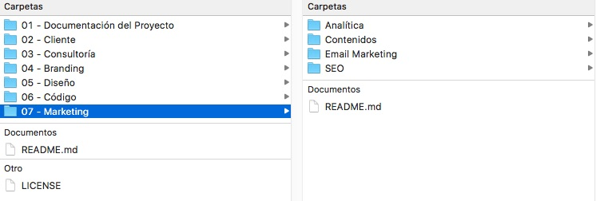

# ¿Qué es PROFS?
PROFS es una estructura de carpetas optimizada para el manejo de proyectos Creativos, de Desarrollo Web o de Marketing Online.



PROFS no es un software, es una metodología y se integra sin complicaciones con cualquier Framework, Herramienta de Gestión o Metodología de Gestión de Proyectos como Scrum o Kanban.

PROFS sigue un conjunto de buenas prácticas que maximiza la organización, facilita la comunicación con el cliente y demás miembros del equipo de trabajo en caso de ser proyectos donde participan varias personas.

PROFS permite:

* Mantener un estructura consistente en todos tus proyectos
* Encontrar rapidamente cualquier archivo
* Mantener consistencia en los nombres de los archivos
* Poder retomar cualquier versión anterior de un archivo

En PROFS se recomienda GIT como Sistema de Control de Versiones. Si bien el uso de Sistemas de Control de Versiones está más extendido en entre los desarrolladores, aporta muchos beneficios a los profesionales creativos.

Cuando se desarrolla un nuevo concepto, sobre todo si la decisión final depende de un tercero (ya sea un cliente o project manager) por lo general es necesario crear varias iteraciones a partir del feedback que se recibe. Esto se convierte es un listado de archivos interminable: mockup-cliente-X-v1.xd, mockup-cliente-X-v1.1.xd, mockup-cliente-X-v2-arreglada.xd y así hasta el infinito.

GIT es gratis, multiplataforma y Open Source, si no sabes por dónde empezar puedes dar los primeros pasos con este [Tutorial de Git](https://try.github.io/levels/1/challenges/1) 

# Que no es PROFS
PROFS no es un Framework de Desarollo, si lo que buscas es un Frontend Framework puedes utilizar el [DevTips Starter Kit](https://github.com/DevTips/DevTips-Starter-Kit), o alguno de los más conocidos como [Bootstrap](http://getbootstrap.com/) o algún otro.

PROFS es Framework Agnostic, lo que significa que puedes usar el Framework que desees para desarrollar tu proyecto. Solo pon los archivos de tu Framework preferido dentro de la carpeta Código y listo. 
# ¿Qué hay dentro?
En esta primera release PROFS incluye una estructura de carpetas e información básica para su uso. En futuras releases se agregarán templates y ejemplos, para tener una visión más detallada puedes revisar el [Changelog](#changelog).

# ¿Cómo están organizadas las carpetas?
PROFS organiza los proyectos en siete (7) carpetas que resumen la mayoría de las áreas o tareas que se desarrollan en un proyecto de desarollo web o de marketing online:

```
XYZ - NOMBRE DEL PROYECTO
└─── 01 - Documentación del Proyecto
└─── 02 - Cliente
│		└─── Carpeta Compartida
│		│   	└─── Diseños
│		│   	└─── Reportes
│		└─── Documentos Enviados
│		└─── Documentos Recibidos
│		└─── Facturas
│		└─── Reuniones
└─── 03 - Consultoría
└─── 04 - Branding
│		└─── Fuentes
│		└─── Guidelines
│		└─── Logo
└─── 05 - Diseño
│		└─── Gráficos
│		└─── Imágenes
│		└─── Mockups
└─── 06 - Código
└─── 07 - Marketing
		└─── Analítica
		│   	└─── Datos
		│   	└─── Reportes
		└─── Contenidos
		│   	└─── Blog
		│   	└─── Reportes
		│   	└─── Social Media
		└─── Email Marketing
		│   	└─── Código
		│   	└─── Diseño
		│   	└─── Reportes
		└─── SEO (Search Engine Optimization)
    			└─── Auditoría
    			└─── Keyword Research
    			└─── Link Building
    			└─── Reportes
```

A continuación te explicamos el contendo de cada una de las carpetas y su uso.

## 01 - Documentación del Proyecto
Esta carpeta contiene toda la documentación referente al proyecto y va a variar en dependencia del tipo de proyecto. 

En proyectos de desarrollo se incluirá el PRD (Product Requirements Document) y el SRS (Software Requirements Specifications).

En proyectos enfocados al diseño, tareas relacionadas con el marketing digital o incluso proyectos de desarrollo más sencillos dónde no existan o no sean necesarios el PRD y el SRS ubique en esta carpeta un documento donde se expliquen los requerimientos generales del proyecto.

## 02 - Cliente
Esta carpeta contiene todos los documentos que establecen las relaciones con el cliente, en ella se encuentran cinco (5) sub carpetas:

### Carpeta Compartida
Como su nombre lo indica, esta carpeta estará compartida con cliente y contendrá los Reportes para el clientes, así como los diseños para aprobar.

Para compartir la carpeta, puede usar algún servicio de file sharing como Dropbox o Google Drive. Usted puede usar alguna herramienta o plataforma que permita compartir directamente sus diseños y conceptos con el cliente, tales como InVision o Adobe XD pero aun así es recomendable que mantenga una copia de estos en la sub carpeta diseños.

### Documentos Enviados
Esta carpeta contiene los documentos no periódicos enviados al cliente, por ejemplo Propuestas, Presupuestos, Estimados o Informes de Finalización de Proyecto. Los reportes mensuales por ejemplo son documentos periódicos, pues se envían de acuerdo a una periodicidad y no deben ir en esta carpeta.

### Documentos Recibidos
Esta carpeta contiene los documentos enviados por el cliente, pueden ser requerimientos, observaciones o similares. 
### Facturas
Mantenga una copia de las facturas emitidas al cliente, incluso si usa un sistema de facturación en línea, descargue una copia en PDF de cada factura y manténgala en esta carpeta.
### Reuniones
En esta carpeta se incluirán los detalles y notas sobre las reuniones con el cliente, ya sea que usted grabe las sesiones en directo, o use algún otro medio para tomar notas.  
## 03 - Consultoría
En esta carpeta se incluirán todos los documentos referentes al proceso de consultoría que se desarrolle para el proyecto.
## 04 - Branding
Esta carpeta contiene los elementos gráficos y de imagen en general de uso común y que han sido previamente definidos. 
### Fuentes
Las familias tipográficas utilizadas por el cliente.
### Style Guidelines
El Manual de estilos y manejo de marca.
### Logo
El logotipo oficial del cliente y sus posibles variaciones

## 05 - Diseño
En esta carpeta se encuentran todos los elemetos y recursos gráficos a ser utilizados en el proyecto, ya sean creados por usted y su equipo o por terceros.
### Gráficos
Aquí se incluyen todos los elementos creados por usted y su equipo, por lo general dibujos, ilustraciones o modificaciones a otras imágenes ya existentes.
### Imágenes
Aquí se incluyen todas las imágenes originales, ya sean creadas por usted y su equipo o por terceros. Sobre todo fotografías, incluyendo las imágenes de Stock.
### Mockups
En esta carpeta incluya los Mockups creados para el proyecto.
## 06 - Código
Dependiendo del proyecto y las tecnologías a usar en esta carpeta ponga una copia de los archivos del proyecto. Por ejemplo en el caso de un nuevo sitio en Wordpress en esta carpeta tendría una copia del tema hijo que esté creando.
## 07 - Marketing
En esta carpeta se encuentra todo lo relacionado a las tareas de marketing y se divide en cuatro (4) sub carpetas:

- Analítica
- Contenidos
- Email Marketing
- SEO

En dependencia del tipo de proyecto puede utiizar todas, eliminar las que no necesite o agregar alguna más en caso de ser necesario.

### Analítica
Esta carpeta incluye dos sub carpetas Datos y Reportes y en ellas va a incluir los datos recopilados con las herramientas de Analítica Web y los Reportes Mensuales respectivamente.


**Pro tips:**

- *En la carpeta Reportes deben estar los reportes originales, aun cuando usted ponga una copia del reporte en la carpeta que comparte con el cliente no borre el reporte original.*

### Contendios
Esta carpeta incluye tres sub carpetas Blog, Social Media y Reportes, donde se incluirán los contenidos creados para cada medio respectivamente.

**Pro tips:**

- *Cree un content calendar e inclúyalo en esta carpeta, si no tiene uno use este template creado por [Hubspot](https://offers.hubspot.com/social-media-content-calendar).*

### Email Marketing
En esta carpeta incluya los diseños, el código y los reportes para las campañas de Email Marketing.

### SEO
Esta carpeta incluye cuatro sub carpetas Auditoría, Keyword Research, Link Building y Reportes, donde se resumen las principales tareas relacionadas al SEO.
 

# ¿Cómo se usa?
Paso 1 - Clona este repositorio o descárgalo directamente a tu equipo.
... ya está no hay más pasos.

# Nombres de Archivos
Para facilitar la búsqueda de archivos en PROFS proponemos seguir las siguientes convenciones.

## Uso de Códigos para clientes, proyectos y archivos
Se recomienda usar códigos de tres (3) letras para identificar los clientes y los proyectos, esto facilitará la búsqueda de archivos.

### Ejemplo de uso

Supongamos que tenemos un cliente de nombre Luis Ernesto Díaz y desarrollaremos un nuevo sitio web para su Agencia de Publicidad que se llama Publitat

```
XYZ - NOMBRE DEL CLIENTE
└─── XYZ - NOMBRE DEL PROYECTO

LED - LUIS ERNESTO DIAZ
└─── SWP - SITIO WEB PUBLITAT

```
Para nombrar los archivos del proyecto incluya el código del proyecto.

```
05 - Diseño
 		└─── Gráficos
 		└─── Imágenes
 		└─── Mockups
 				└─ SWP - Mockups.xd
```
En este caso se excluyen los archivos que forman parte del código de aplicaciones.

## Nombres de reportes
Para nombrar los reportes mantenga la misma convención de incluir las iniciales del proyecto y agregar Reporte + Tipo de reporte + Fecha.

Aquí tenemos un ejemplo denombres de reportes y otros documentos de trabajo.


```
SEO (Search Engine Optimization)
		└─── Auditoría
		└─── Keyword Research
		└─── Link Building
				└─ SWP - Link Building Plan.xlsx
				└─ SWP - Link Building Outreach.xlsx
		└─── Reportes
				└─ SWP - Reporte Link Building - Marzo 2017.xlsx
				└─ SWP - Reporte Keyword Rankigs - Marzo 2017.xlsx
```
# ¿Cómo contribuir?
Si quieres ayudar a mejorar este proyecto aquí te explico cómo:

## Comparte los templates que usas
Si tienes templates reales de tus workflow te estamos buscando, necesitamos templates de:

- Planificación de una campaña de link building
- Reportes de Link Building, Analítica Web, Social Media y Email Marketing.
- Auditoría SEO
- PRD
- SRS
- Calendario de Publicación de Contenidos
- Template de Propuesta de Servicios

## Traduce este documento y los nombres de las carpetas
Traduce este proyecto a otro idioma, de momento está en español e inglés. Si deseas traducirlo clona el reporsitorio y cambia este docuemento, los nombres de las carpetas y los documentos.

## Aporta nuevas ideas
Si tu workflow es diferente y crees que deberíamos incluir, modificar o eliminar alguna carpeta, déjanos saber.
 

### Directamente en GitHub
- [Crea un Fork] (https://github.com/alienmtnez/PROFS/fork)
- Agrega tus cambios
- Crea un Pull Request

### Escríbeme
[Envíame un email](mailto:alien.mtnez@gmail.com)

# <a name="changelog"></a>Change Log
Aquí puedes seguir los cambios y funcionalidades que irán siendo agregadas.

## Unreleased
- Documentación y ejemplos de uso en cada carpeta.
- Templates para crear la Documentación del Proyecto (PRD & SRS).
- Template de Propuesta de Servicios.
- Template de Modelo de Contrato de Servicios.
- Template de Style Guidelines.
- Template de Auditoría SEO.
- Template de Planificación de Campaña de Link Bulding.
- Template de Calendario de Creación de Contenidos.

## [0.1.0] - 2017-03-20
### Added
- Estructura básica de carpetas.
- Documentación inicial.

# Licencia
GNU General Public License v3.0 Vea [LICENSE.md](https://github.com/alienmtnez/PROFS/blob/master/LICENSE) para más información.
